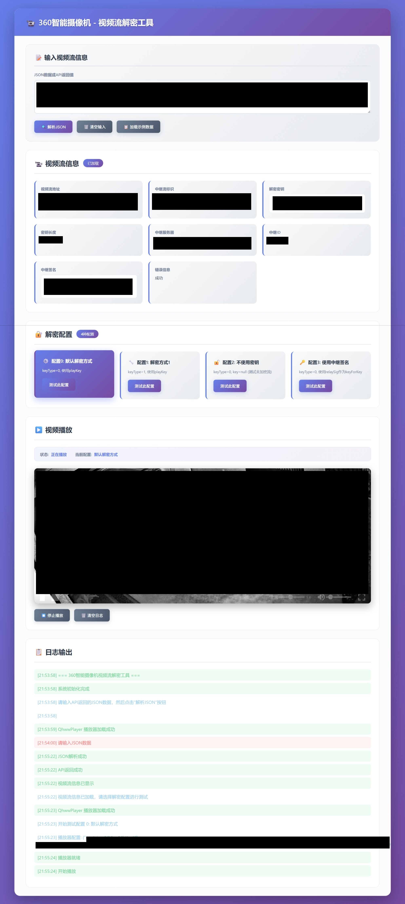

# 360智能摄像机视频流工具

本项目当前分成三部分：

- `backend/`
  负责获取播放信息、批量同步、流代理和本地配置
- `web/`
  负责前端播放调试页和播放器资源
- `docs/`
  负责项目结构、后端说明和解密分析



## 快速开始

```bash
cd backend
pip install -r requirements.txt
cp config.example.yaml config.yaml
python server.py
```

打开 `http://127.0.0.1:5000/` 即可使用前端页面。

常用命令：

```bash
cd backend
python server.py
python get_play_info.py
python camera_api_cli.py --sn 3601Q0700624502 --cookie-file cookies.txt
```

## 目录入口

- 后端说明: [docs/backend-api.md](docs/backend-api.md)
- 项目结构: [docs/PROJECT_STRUCTURE.md](docs/PROJECT_STRUCTURE.md)
- 解密分析: [docs/decryption-analysis.md](docs/decryption-analysis.md)

## 核心路径

- 后端核心代码: `backend/app/`
- 后端兼容入口: `backend/server.py`、`backend/get_play_info.py`、`backend/camera_api_cli.py`
- 前端调试页: `web/index.html`
- 原始留档资料: `save_web/`

1. 未授权访问他人设备
2. 侵犯他人隐私
3. 任何非法用途

## 技术细节

### API接口

**V1接口**: `/app/play`
**V2接口**: `/app/playV2`

**请求参数**:

```javascript
{
    taskid: Date.now(),      // 时间戳
    from: 'mpc_ipcam_web',  // 来源标识
    sn: '摄像机SN号',        // 摄像机序列号
    mode: 0                  // 播放模式
}
```

**返回数据**:

```javascript
{
    errorCode: 0,            // 错误代码，0表示成功
    errorMsg: '',             // 错误信息
    relayStream: 'xxx',      // 中继流标识
    playKey: 'xxx'           // 播放密钥（加密流才有）
}
```

### 播放器配置

```javascript
const player = new QhwwPlayer({
    container: container,      // 容器元素
    src: videoUrl,            // 视频流地址
    key: playKey,             // 解密密钥
    keyType: 0,              // 解密方式
    isLive: true,             // 是否直播
    autoplay: true,           // 自动播放
    logLevel: 1               // 日志级别
});
```

## 许可证

本项目仅用于学习和研究目的，请遵守相关法律法规。

## 联系方式

如有问题或建议，请通过以下方式联系：

- 提交 Issue
- 发送邮件 shidai567@outlook.com
